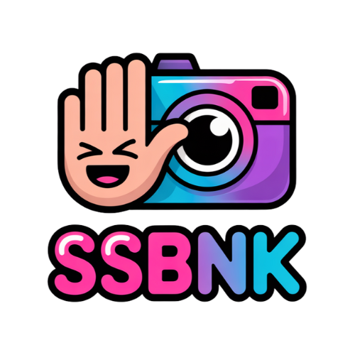

<div align="center">
  
  
  # ssbnk (ScreenShot Bank)
  
  **Screenshot sharing that hits different**
  
  > *Pronounced "spank" - because your screenshots deserve a good hosting!*
</div>

I built ssbnk because I couldn't find a screenshot hosting solution that was simple and flexible enough for my LLM workflow. 

Here's the problem: Modern AI tools like Claude Code and OpenCode require image URLs, not local files. When you're SSH'd into a dev machine, getting screenshots to these tools is a pain:
- First you have to scp the file over
- Then deal with default screenshot names full of spaces and massive date strings
- Rename everything to something sane like `1.png`
- Still manually point to each image

Sometimes I just want a symlink to the "current" screenshot. Other times I need to reference multiple screenshots in a batch. Existing solutions were either too complex, too slow, or required too much manual work.

ssbnk solves this by automatically:
- Watching your screenshot directory
- Renaming files to clean, timestamp-based names
- Hosting them instantly via HTTPS
- Copying the URL to your clipboard
- Managing retention and cleanup

Dead simple. Lightning fast. Built for developers who use AI tools.

### The Workflow

```bash
# Take a screenshot (however you normally do)
# It's saved to ~/screenshots/Screenshot 2024-03-15 at 2.35.47 PM.png

# ssbnk automatically:
# 1. Detects the new file
# 2. Renames it to: 20240315-1435.png
# 3. Hosts it at: https://screenshots.example.com/hosted/20240315-1435.png
# 4. Copies URL to clipboard

# Now just paste into Claude Code/OpenCode/ChatGPT
# No manual steps. No renaming. No uploading.
```

[](https://www.docker.com/)
[](https://golang.org/)
[](https://nginx.org/)

[](https://hub.docker.com/r/ssbnk/ssbnk)
[](https://ghcr.io/delorenj/ssbnk)
[](https://hub.docker.com/r/ssbnk/ssbnk)

## ✨ Features

- 📸 **Instant hosting**: Screenshots are immediately available via HTTPS
- 📋 **Auto-clipboard**: URLs automatically copied to clipboard
- 🗑️ **Smart cleanup**: Configurable retention with intelligent daily cleanup
- 🖥️ **Display server agnostic**: Supports both X11 and Wayland seamlessly
- 🔒 **Secure by default**: Hosted behind Traefik reverse proxy with automatic TLS
- 🐳 **Containerized**: Easy deployment with Docker Compose
- ⚡ **Lightning fast**: Go-powered file watcher with minimal overhead
- 🎯 **Zero configuration**: Works out of the box with sensible defaults

## 🚀 Quick Start

### Option 1: Docker Image (Recommended)

The easiest way to get started is with our pre-built Docker image:

```bash
# Quick start with default settings
curl -sSL https://raw.githubusercontent.com/delorenj/ssbnk/main/scripts/run-ssbnk.sh | bash

# Or run manually
docker run -d \
  --name ssbnk \
  --network host \
  --privileged \
  -v $HOME/screenshots:/watch \
  -v ssbnk_data:/data \
  -v /tmp/.X11-unix:/tmp/.X11-unix:rw \
  -v /run/user/1000:/run/user/1000:rw \
  -e SSBNK_URL=https://screenshots.example.com \
  -e DISPLAY=$DISPLAY \
  -e WAYLAND_DISPLAY=$WAYLAND_DISPLAY \
  -e XDG_RUNTIME_DIR=/run/user/1000 \
  ssbnk/ssbnk:latest
```

### Option 2: Docker Compose (Packaged)

```bash
# Download the packaged compose file
curl -O https://raw.githubusercontent.com/delorenj/ssbnk/main/docker-compose.packaged.yml
curl -O https://raw.githubusercontent.com/delorenj/ssbnk/main/.env.example

# Configure
cp .env.example .env
nano .env  # Edit with your settings

# Run
docker compose -f docker-compose.packaged.yml up -d
```

### Option 3: Build from Source

For development or customization:

```bash
git clone https://github.com/delorenj/ssbnk.git
cd ssbnk
cp .env.example .env
nano .env  # Edit with your settings
docker compose up -d
```

### Prerequisites

- Docker and Docker Compose
- A domain name (for HTTPS hosting)
- Traefik reverse proxy (or modify for your preferred proxy)

## ⚙️ Configuration

### Environment Variables

Create a `.env` file from `.env.example` and customize:

```bash
# Service URL (full URL with https://)
SSBNK_URL=https://ssbnk.example.com

# Service domain (domain only, for Traefik)
SSBNK_DOMAIN=ssbnk.example.com

# Screenshot source directory (where you save screenshots)
SSBNK_WATCH_DIR=/home/username/screenshots

# Retention period (days)
SSBNK_RETENTION_DAYS=30

# Display server (auto-detected)
DISPLAY=:0
WAYLAND_DISPLAY=wayland-0  # if using Wayland
```

### Directory Structure

```
ssbnk/
├── compose.yml           # Docker Compose configuration
├── .env.example         # Environment template
├── nginx/               # Nginx configuration
├── watcher/             # Go file watcher service
├── scripts/             # Utility scripts
└── docs/               # Documentation
```

## 🏗️ Architecture

ssbnk consists of four main components:

- **📁 nginx**: Serves hosted screenshots with optimized caching
- **👀 watcher**: Go service that processes new screenshots in real-time
- **🧹 cleanup**: Daily cleanup service for old files with smart archiving
- **🔒 traefik**: Reverse proxy with automatic TLS (external dependency)

## 🔄 Workflow

1. Screenshot saved to your configured watch directory
2. Watcher detects new file instantly
3. File moved to hosted directory with timestamp-based naming
4. URL copied to clipboard automatically
5. Metadata stored for management and cleanup
6. Daily cleanup archives old files based on retention policy

## 🖥️ Display Server Support

ssbnk automatically detects and supports:

- **X11**: Uses `xclip` for clipboard access
- **Wayland**: Uses `wl-copy` for clipboard access

See [docs/DISPLAY_SERVERS.md](docs/DISPLAY_SERVERS.md) for detailed setup instructions and troubleshooting.

## 🛠️ Development

### Local Development

```bash
# Build and run
docker compose up --build

# View logs
docker compose logs -f ssbnk-watcher

# Test clipboard functionality
docker compose exec ssbnk-watcher which wl-copy
docker compose exec ssbnk-watcher which xclip
```

### Testing

```bash
# Run the detection script
./scripts/detect-display-server.sh

# Force sync a screenshot
./scripts/force-screenshot-sync.sh /path/to/screenshot.png

# Test cleanup
docker compose exec ssbnk-cleanup /cleanup.sh
```

## 🐛 Troubleshooting

### Common Issues

1. **Clipboard not working**: Run `./scripts/detect-display-server.sh` to verify your setup
2. **Files not being detected**: Check logs with `docker compose logs ssbnk-watcher`
3. **Permission issues**: Ensure your user has access to the watch directory
4. **HTTPS issues**: Verify Traefik configuration and DNS settings

### Debug Commands

```bash
# Check container status
docker compose ps

# View watcher logs
docker compose logs -f ssbnk-watcher

# Check file permissions
ls -la /path/to/your/screenshot/directory

# Test clipboard manually
echo "test" | xclip -selection clipboard  # X11
echo "test" | wl-copy                     # Wayland
```

## 📚 Documentation

- [Display Server Setup](docs/DISPLAY_SERVERS.md)
- [Configuration Guide](docs/CONFIGURATION.md)
- [Troubleshooting Guide](docs/TROUBLESHOOTING.md)
- [API Documentation](docs/API.md)

## 🤝 Contributing

We love contributions! Please read our [Contributing Guidelines](#contributing-guidelines) below.

### Contributing Guidelines

#### 🎯 Code of Conduct

- Be respectful and inclusive
- Focus on constructive feedback
- Help others learn and grow
- Keep discussions technical and on-topic

#### 🔧 Development Process

1. **Fork the repository**
2. **Create a feature branch**: `git checkout -b feature/amazing-feature`
3. **Make your changes** following our coding standards
4. **Add tests** for new functionality
5. **Update documentation** as needed
6. **Commit with clear messages**: `git commit -m 'Add amazing feature'`
7. **Push to your branch**: `git push origin feature/amazing-feature`
8. **Open a Pull Request**

#### 📝 Coding Standards

- **Go**: Follow `gofmt` and `golint` standards
- **Shell**: Use `shellcheck` for script validation
- **Docker**: Follow multi-stage build best practices
- **Documentation**: Update README and relevant docs for any changes

#### 🧪 Testing Requirements

- All new features must include tests
- Existing tests must pass
- Manual testing instructions should be provided
- Integration tests preferred for complex features

#### 📋 Pull Request Guidelines

- **Clear title**: Describe what the PR does
- **Detailed description**: Explain the why and how
- **Link issues**: Reference related issues with `Fixes #123`
- **Screenshots**: Include before/after for UI changes
- **Testing**: Describe how you tested the changes

#### 🐛 Bug Reports

When reporting bugs, please include:

- **Environment details**: OS, Docker version, display server
- **Steps to reproduce**: Clear, numbered steps
- **Expected behavior**: What should happen
- **Actual behavior**: What actually happens
- **Logs**: Relevant log output
- **Screenshots**: If applicable

#### 💡 Feature Requests

For new features:

- **Use case**: Describe the problem you're solving
- **Proposed solution**: How you envision it working
- **Alternatives**: Other solutions you considered
- **Implementation ideas**: Technical approach (if you have one)

#### 🏷️ Issue Labels

- `bug`: Something isn't working
- `enhancement`: New feature or request
- `documentation`: Improvements or additions to docs
- `good first issue`: Good for newcomers
- `help wanted`: Extra attention is needed
- `question`: Further information is requested

## 📄 License

This project is licensed under the MIT License - see the [LICENSE](LICENSE) file for details.

## 🙏 Acknowledgments

- Built with ❤️ for the developer community
- Inspired by the need for simple, fast screenshot sharing
- Thanks to all contributors who make this project better

## 🔗 Links

- [Issues](https://github.com/delorenj/ssbnk/issues)
- [Pull Requests](https://github.com/delorenj/ssbnk/pulls)
- [Releases](https://github.com/delorenj/ssbnk/releases)
- [Wiki](https://github.com/delorenj/ssbnk/wiki)

---

**Made with 📸 and ☕ by developers, for developers.**
